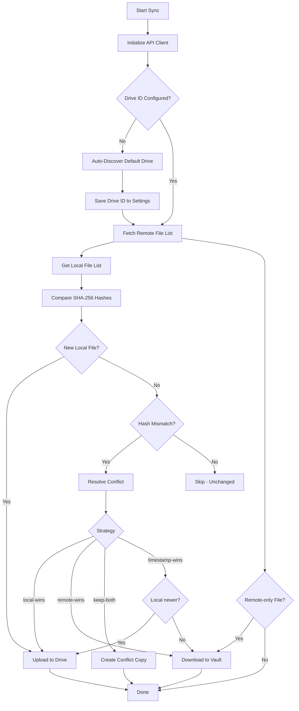

# 🔗 Here.Now Sync

> Bidirectional synchronization between your Obsidian vault and [here.now](https://here.now) Drives (private cloud storage) or Sites (public URLs), with offline support, conflict resolution, secure API key storage, and comprehensive diagnostic logging.


---

## ✨ Features

### Core Sync Engine
- **🔄 Bidirectional Sync** — Local ↔ remote file synchronization with SHA-256 content-based change detection
- **⏱️ Periodic Auto-Sync** — Configurable intervals: 5min, 15min, 30min, 1h, 2h
- **📴 Offline Queue** — Changes are queued locally with exponential backoff retry; auto-syncs when connectivity returns
- **⚔️ Conflict Resolution** — Four strategies: timestamp-wins (last-write), local-wins, remote-wins, or keep-both (creates `.conflict-` copies)
- **🗑️ Smart Trash Handling** — Locally deleted files move to a `.trash/` folder instead of remote deletion (prevents accidental data loss)
- **📁 Full File Support** — Markdown, images, PDFs, binaries, attachments, code files (all MIME types supported)
- **🌐 Site Publishing** — Auto-publish synced Drive snapshots to public here.now Sites after successful sync

### Drive Auto-Discovery
- **🔍 Smart Drive Resolution** — When no Drive ID is configured, the plugin auto-discovers your default here.now Drive on first sync
- **💾 Persisted Drive ID** — Discovered Drive ID is saved to settings automatically; subsequent syncs use it directly
- **📋 Drive Info** — Shows connected Drive name, file count, and timestamps in sync logs

### Right Panel - Sync Dashboard
- **📊 Live Sync Logs** — Real-time log display with status indicators (✅ Success, ⏳ Pending, ❌ Failed)
- **🔍 Clickable Log Entries** — Click any log entry to expand and view full details
- **🎛️ Filter Controls** — Filter logs by level: All | ❌ Errors | ⚠️ Warnings
- **🔄 Sync Button** — Start bidirectional synchronization directly from the panel
- **🗑️ Clear Logs** — Delete all logs and refresh the panel
- **⚙️ Settings Access** — Quick access to plugin settings via gear icon
- **📱 Ribbon Integration** — Click the ribbon icon to open the right panel anytime

### Diagnostics & Troubleshooting
- **📋 Persistent Sync Logger** — In-memory log captures up to 500 entries with timestamps, severity levels, and operation categories
- **🔍 Context-Aware Error Messages** — Network errors show specific guidance (proxy/VPN detection, DNS failures, timeouts, SSL errors)
- **📤 Log Export** — Export all logs as a formatted markdown note for sharing/debugging
- **📊 Diagnostics UI** — Dedicated "Diagnostics" section in plugin settings with View Logs, Export All, and Clear buttons
- **⌨️ Debug Commands** — Accessible via Command Palette (Ctrl+P):
  - `View sync logs` — Opens the right panel with logs
  - `Export all sync logs to file` — Creates a markdown note with full log history
  - `Clear sync logs` — Reset the log buffer

### Security
- **🔐 SecretStorage Integration** — API keys stored exclusively in OS keychain via Obsidian's `SecretStorage` API (Windows Credential Manager, macOS Keychain, Linux Secret Service)
- **🚫 No Secrets in data.json** — API keys are NEVER stored in plugin settings or data.json files
- **🔑 SecretComponent UI** — Settings panel uses Obsidian's native `SecretComponent` for secure secret selection
- **⚠️ Missing Secret Alert** — If no API key is configured, users see a prominent alert with a button to open Obsidian's Secrets panel
- **🧪 Safe Key Testing** — "Test Connection" button validates the API key before saving
- **🛡️ Secure by Default** — All API calls use HTTPS/TLS; no file contents logged; minimal permissions

### Network Resilience
- **📡 Online/Offline Detection** — Automatic detection via `navigator.onLine` events
- **🔄 Queue Processing** — Queued operations processed with exponential backoff (1s → 2s → 4s → 8s, max 30s)
- **⏱️ Sync Scheduling** — Skips periodic sync if another sync is already running (prevents concurrent operations)
- **🚦 Rate-Limiting Aware** — Built-in 200ms delay between operations to respect API quotas

### UI & UX
- **📊 Status Bar** — Live sync progress with percentage, elapsed time, and operation counters
- **📊 Status Bar Context Menu** — Allows selecting specific actions such as Publish to Site, view logs
- **🔔 Notifications** — Configurable modal notifications for sync events (enable/disable in settings)
- **🎀 Right Sidebar Panel** — Dedicated panel for sync logs, actions, and real-time monitoring
- **🔄 Ribbon Icon** — One-click access to the sync panel from the sidebar

---

## 📥 Installation

### Option 1: BRAT (Recommended)
1. Install the [BRAT plugin](https://github.com/TfTHacker/obsidian42-brat)
2. Open BRAT settings → `Add a beta plugin`
3. Paste: `https://github.com/Nanocult/here-now-sync`
4. Enable in Community Plugins

### Option 2: Manual
1. Download the latest release (`here-now-sync.zip`)
2. Extract to `.obsidian/plugins/here-now-sync/` in your vault
3. Enable in `Settings → Community Plugins`

### Option 3: Development
```bash
git clone https://github.com/Nanocult/here-now-sync.git
cd here-now-sync
npm install
npm run build
```
Copy `dist/main.js`, `dist/manifest.json`, and `dist/styles.css` to your vault's plugin folder.

---

## ⚙️ Configuration

### 1. API Key Setup (Using SecretStorage)
1. Generate a key at [here.now Dashboard](https://here.now/#api-key)
2. Open Obsidian **Settings → Secrets** panel
3. Click **Add secret** and enter:
   - **Name**: `here-now-api-key` (or any name you prefer)
   - **Value**: Your here.now API key
4. Open plugin settings → `🔐 Authentication`
5. Use the dropdown to select your saved secret from SecretStorage
6. Click **Test connection** to verify it works

> **⚠️ Important**: If no secret is configured, you'll see an alert with a button to quickly open the Secrets panel.

### 2. Sync Settings

| Setting | Description | Default |
|---------|-------------|---------|
| **Sync Interval** | Auto-sync frequency (5m / 15m / 30m / 1h / 2h) | 15 minutes |
| **Sync Scope** | Entire vault or specific folders | Entire vault |
| **Exclude Patterns** | Glob patterns to ignore | `*.tmp, *.log, .DS_Store, node_modules/**` |
| **Conflict Strategy** | How to handle simultaneous edits | Timestamp-wins |
| **Manual Merge Prompt** | Show dialog for conflicts | Enabled |
| **Trash Folder** | Local folder for deleted files | `.trash/` |

### 3. Storage Target
- **🔒 Drive (Default)** — Private storage on here.now that mirrors your vault structure
- **🌐 Site (Optional)** — Public URL. Enable `Auto-publish to Site` to snapshot Drive after sync

### 4. Right Panel Usage
- **Open Panel**: Click the ribbon icon (🔗) in the left sidebar
- **View Logs**: See real-time sync activity with color-coded status indicators
- **Filter Logs**: Use filter buttons to show All, Errors only, or Warnings only
- **Start Sync**: Click the **Sync** button to trigger manual synchronization
- **Clear Logs**: Click **Clear** to remove all log entries
- **Access Settings**: Click the **⚙️** icon to open plugin settings

### 5. Diagnostics
- **📋 View Logs** — Opens the right panel with log entries
- **📤 Export All** — Exports complete log history as a markdown note
- **🗑️ Clear** — Resets the in-memory log buffer

---

## 🎯 Commands

| Command | ID | Description |
|---------|----|-------------|
| Sync now with here.now | `sync-now` | Trigger manual full sync |
| Toggle periodic sync | `toggle-sync` | Enable/disable auto-sync |
| Publish current vault to here.now Site | `publish-to-site` | Manual Site publish |
| View sync logs | `view-sync-logs` | Open the right panel with logs |
| Export all sync logs to file | `export-all-sync-logs` | Create a markdown note with full log history |
| Clear sync logs | `clear-sync-logs` | Reset log buffer |

All commands accessible via `Ctrl+P` (Command Palette).

---

## 🔄 How Sync Works



---

## 🗑️ Deletion Policy

- Local deletion → File moves to `.trash/` folder (excluded from sync)
- Remote deletion → **Ignored** (prevents accidental data loss)
- Manual review: Check `.trash/` folder in Obsidian or restore via plugin commands
- Remote trash not implemented — relies on local `.trash/` folder only

---

## 🌐 Offline Mode

- All file events are queued with timestamps and operation type
- Exponential backoff retry: 1s → 2s → 4s → 8s (max 3 attempts)
- Max queue size: 100 operations (oldest dropped if full)
- Auto-sync triggers immediately when `navigator.onLine` becomes `true`
- Status bar shows queue count when offline

---

## 🛡️ Security & Privacy

- ✅ API keys stored in OS keychain (Windows Credential Manager, macOS Keychain, Linux Secret Service)
- ✅ Fallback to encrypted settings storage on unsupported platforms
- ✅ All API calls use HTTPS/TLS
- ✅ No file contents logged or transmitted in plaintext
- ✅ Minimal permissions: `network`, `vault-access`
- ✅ Keys validated before saving ("Test" button tests without saving)
- ✅ Custom `X-HereNow-Client` header for API tracking

---

## ❓ Troubleshooting

| Issue | Solution |
|-------|----------|
| `Connection failed` | Verify API key; check network/VPN/proxy; open Right Panel for detailed logs |
| `Rate limit exceeded` | Wait 1 hour or increase sync interval in settings |
| `Sync stuck` or timeout | Check Right Panel logs or **View Logs** in Diagnostics section for errors |
| `Files not uploading` | Ensure file isn't in `.trash/` or excluded patterns |
| `Mobile sync fails` | Verify network permissions; avoid large binary files on cellular |
| `Conflict loop` | Switch to `local-wins` or enable `Manual Merge Prompt` |
| `TUNNEL_CONNECTION_FAILED` | Check Obsidian proxy settings (`Settings → About → Network proxy`); disable VPN |
| `Cannot read 'SetSecret'` | Plugin handles this automatically (falls back to settings storage) |

**Debug Mode**: Enable `Show Detailed Logs` in settings → Check Right Panel or open DevTools (`Ctrl+Shift+I` → Console)

---

## 🛠️ Development

### Prerequisites
- Node.js 18+
- Obsidian Desktop (for testing)

### Commands
```bash
npm run dev        # Watch mode (auto-rebuild on save)
npm run build      # Production build (minified, outputs to dist/)
npm run lint       # ESLint check
npm run test       # Run Jest tests
```

### Distribution
The build process creates a `dist/` folder with all required files:
- `dist/main.js` — Compiled plugin code
- `dist/manifest.json` — Plugin manifest
- `dist/styles.css` — Plugin styles

Copy the entire `dist/` folder contents to your vault's plugin directory.

---

## 🤝 Contributing

1. Fork & clone repository
2. Create feature branch (`git checkout -b feat/amazing-feature`)
3. Commit changes (`git commit -m 'Add amazing feature'`)
4. Push & open Pull Request

Please follow [Obsidian Plugin Guidelines](https://docs.obsidian.md/Home) and maintain TypeScript strict mode.

---

## 📄 License

[MIT](LICENSE) © 2026 Nanocult
